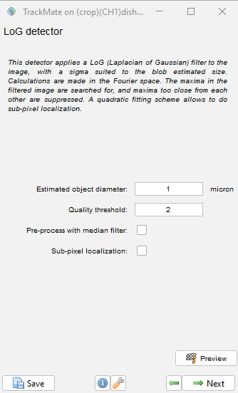
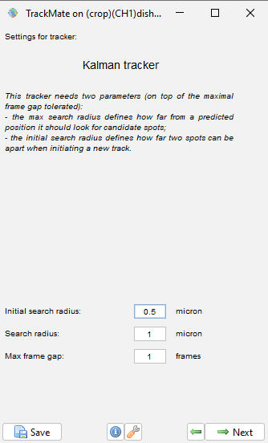
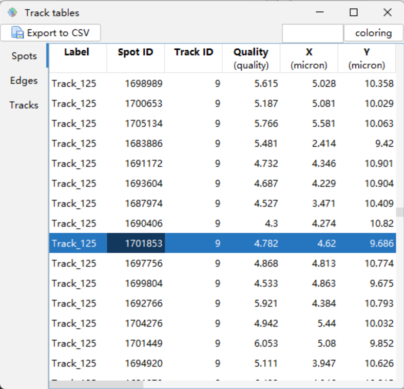
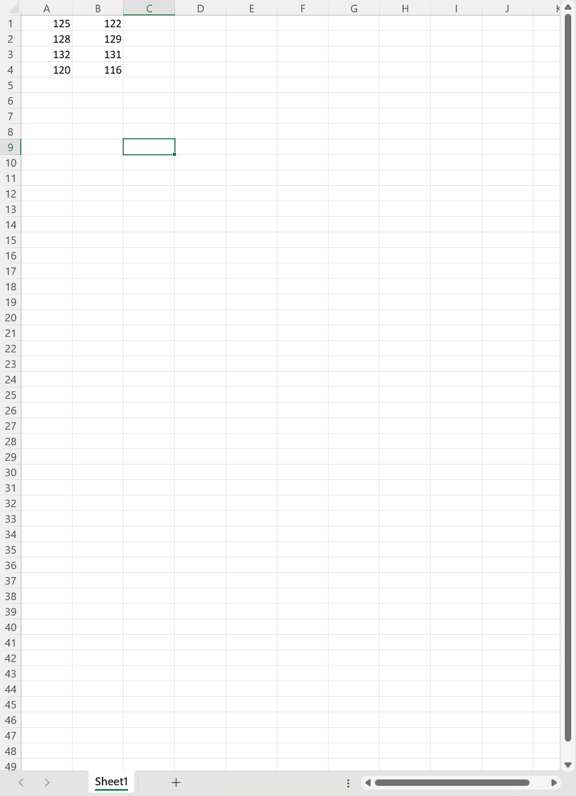

# Kinetochore Morphology Analysis Protocol

This protocol describes the current workflow for quantifying kinetochore morphology from live-cell fluorescence movies. It is written for repository use and is intended to be uploaded as `PROTOCOL.md` alongside the pipeline code.

## Scope

The workflow starts from tracked kinetochore movies and manually curated sister-pair labels, then produces rotated kinetochore image crops, per-frame morphology measurements, movement summaries, Ch1/Ch2 ZNCC protein-vector measurements for double-channel datasets, and target/background KT signal overlap QC tables.

Two analysis modules must be kept conceptually separate:

- Ch1/Ch2 ZNCC fitting is a double-channel protein1-to-protein2 vector measurement.
- Target/background KT signal overlap filtering is a single-channel intensity/area QC step for frames where background or neighboring kinetochore signal overlaps the target KT signal.

ZNCC fitting does not read, write, filter by, or depend on the `PreSelect` flag. The KT-overlap filter does not use ZNCC.

## Required Software

- Fiji/ImageJ with TrackMate
- Wolfram Mathematica
- A spreadsheet editor for sister-pair annotation, such as Excel
- This repository's Wolfram Language files and notebook wrappers

## Repository Files

| File | Purpose |
|---|---|
| `KKCalculationAndRotation.wl` | Reads TrackMate tracking output and sister-pair annotation, computes K-K geometry, and optionally exports rotated central-z KT projections. |
| `singleImageAnalysis.wl` | Runs and displays analysis for one KT image. Use this before batch processing to tune parameters. |
| `mainprogram.wl` | Runs batch analysis on rotated KT image folders and exports per-KT CSV files plus inspection plots. |
| `result_extract.wl` | Combines per-KT results, movement summaries, ZNCC fitting vectors, and KT-overlap QC into experiment-level tables. |
| `runKKCalculationRotation.nb` | Notebook wrapper for `KKCalculationAndRotation.wl`. |
| `runSingleImageAnalysis.nb` | Notebook wrapper for `singleImageAnalysis.wl`. |
| `runMainprogram.nb` | Notebook wrapper for `mainprogram.wl`. |
| `runResult_extract.nb` | Notebook wrapper for `result_extract.wl`. |

## Input Data

Each cell folder should contain:

| Input | Required | Notes |
|---|---:|---|
| Raw or preprocessed 4D movie files | Yes | TIFF files should retain metadata for channel, z-slice, frame number, and pixel calibration. |
| `export.csv` | Yes | TrackMate export containing spot IDs, track labels, frame numbers, and XYZ coordinates. |
| `pairs.xlsx` or `Pairs.xlsx` | Yes | Manually curated sister-pair table using numeric TrackMate labels. For example, `track_125` should be entered as `125`. |
| Channel folders such as `ch1` and `ch2` | Yes | Use one channel for single-channel datasets and two channels for double-channel datasets. |

Recommended structure:

```text
experiment_root/
  cell_001/
    export.csv
    pairs.xlsx
    ch1/
      movie_or_kt_files.tif
    ch2/
      movie_or_kt_files.tif
  cell_002/
    export.csv
    pairs.xlsx
    ch1/
    ch2/
```

Folder names can vary, but the scripts expect consistent cell folders, TrackMate output, sister-pair annotation, channel folders, and rotated KT analysis folders.

## Step 1. Prepare Movies for Tracking

Before TrackMate tracking:

1. Confirm microscope calibration metadata:
   - pixel width
   - pixel height
   - z-step size
   - time interval
2. Use the channel intended for tracking. Avoid tracking on unnecessary channels because extra channels can increase ambiguity and processing time.
3. Crop movies to a region that contains the cell and relevant kinetochores. Smaller movies reduce tracking and batch-processing time.
4. If needed for easier manual curation, rotate the field so the pole-to-pole axis is approximately horizontal before tracking. Keep a record of any preprocessing applied before TrackMate.

## Step 2. Track Kinetochores in TrackMate

Use TrackMate in Fiji/ImageJ to track kinetochores in 3D over time.

Recommended tracking checks:

1. Confirm calibration values inside TrackMate before detection.
2. Choose a spot diameter large enough to include kinetochore signal and deformation. A starting value near `1 um` is reasonable when the apparent FWHM is about `0.35 um`, but this should be adjusted for the imaging setup.
3. Inspect spots in all z-slices and timepoints. Avoid accepting tracks that sit on z-boundaries or repeatedly lose the target KT.
4. Apply track filters as needed:
   - remove very short tracks
   - remove tracks with poor z-coverage
   - remove obvious non-KT tracks
5. Use TrackMate track names or labels consistently so the exported labels can be matched back to image tracks.
6. Export the TrackMate table as `export.csv` into the corresponding cell folder.

Example TrackMate detector and tracker panels are shown below for orientation. The numeric values in screenshots are examples from an older dataset and should be tuned for each microscope setup and image quality.





After tracking, use the TrackMate table export to save the tracking table as CSV. The pipeline expects TrackMate labels, track IDs, frame numbers, and XYZ coordinates to be present in `export.csv`.



## Step 3. Curate Sister KT Pairs

Create a sister-pair spreadsheet named `pairs.xlsx` or `Pairs.xlsx` in each cell folder.

Use numeric TrackMate labels only:

```text
track_125 -> 125
track_126 -> 126
```

Recommended columns:

| Column | Meaning |
|---|---|
| `KT1` | Numeric TrackMate label for the first sister KT. |
| `KT2` | Numeric TrackMate label for the paired sister KT. |
| Optional notes | Manual QC notes, such as uncertain pairing or partial tracks. |

Before running the computational pipeline, visually verify that each pair is a true sister pair and that both tracks cover the timepoints of interest.

Example sister-pair spreadsheet:



## Step 4. Calculate K-K Geometry and Rotate KT Images

Run this step after TrackMate tracking and sister-pair curation.

```wl
script = SystemDialogInput["FileOpen", WindowTitle -> "Select KKCalculationAndRotation.wl"];
root = SystemDialogInput["Directory", WindowTitle -> "Select the experiment root folder"];

If[script =!= $Canceled && root =!= $Canceled,
  Get[script];
  runKKCalculationAndRotation[
    root,
    "ChannelCount" -> 2,
    "RunRotation" -> True,
    "ImageChannel" -> 1,
    "CropFraction" -> 0.7,
    "Parallel" -> True,
    "Kernels" -> 4
  ]
]
```

Use `"ChannelCount" -> 1` for single-channel datasets and `"ChannelCount" -> 2` for double-channel datasets.

Important outputs:

| Output | Meaning |
|---|---|
| `kkVECTOR*.csv` | K-K vectors for paired sister KTs. |
| `(number)kkDistance*.csv` | K-K distance values. |
| `(number)kkDistanceWithFramesNumberOnly*.csv` | K-K distance aligned to frame numbers. |
| `kkAngle*.csv` and `kkAngleWithFrame*.csv` | K-K axis angle used for rotation. |
| `KTlocation_*self.csv` and `KTlocation_*sister.csv` | Self and sister KT location tables. |
| `(+-1).tif` | Central z-stack projection selected for KT analysis. |
| `(+-1)/` | Rotated KT image frames used by batch morphology analysis. |

## Step 5. Tune Image-Analysis Parameters on Representative Images

Before batch processing, test representative KT images with `singleImageAnalysis.wl`.

```wl
script = SystemDialogInput["FileOpen", WindowTitle -> "Select singleImageAnalysis.wl"];

If[script =!= $Canceled,
  Get[script];
  runAndDisplaySingleImageAnalysis[]
]
```

Inspect:

| QC item | What to verify |
|---|---|
| Segmentation mask | Target KT signal is retained while neighboring signal and chromatin are excluded. |
| Boundary dilation | Dim KT boundary signal is included without adding unrelated background. |
| 1D projections | X/Y profiles match the visible KT signal. |
| Peak detection | True peaks are retained and noise peaks are rejected. |
| Tail detection | Derivative extrema match visually obvious tail-like signal. |
| Scale | Length outputs and scale bar match the configured `pixelsize`. |

Tune parameters only when a consistent failure mode appears across representative images.

## Step 6. Run Batch KT Image Analysis

After single-image QC is stable, run batch analysis.

```wl
script = SystemDialogInput["FileOpen", WindowTitle -> "Select mainprogram.wl"];
root = SystemDialogInput["Directory", WindowTitle -> "Select the experiment root folder"];

If[script =!= $Canceled && root =!= $Canceled,
  Get[script];
  batch = runMainBatchAnalysis[
    root,
    "Kernels" -> 4,
    "ChunkSize" -> Automatic,
    "Resume" -> True,
    "ExportPlots" -> True
  ];
]
```

The batch runner searches for `(+-1)` folders, analyzes each KT image sequence, and writes per-KT CSV files plus inspection plots.

Recommended settings:

| Option | Recommendation |
|---|---|
| `"Resume" -> True` | Keep enabled for large datasets. Completed folders are tracked in `finished.csv`. |
| `"ExportPlots" -> True` | Keep enabled during analysis and QC. |
| `"Kernels" -> 4` | Good starting value for routine processing. Adjust based on CPU and memory. |
| `"ChunkSize" -> Automatic` | Use unless memory pressure or long chunks become a problem. |

## Step 7. Extract Experiment-Level Results

Run `result_extract.wl` after batch KT image analysis is complete.

```wl
script = SystemDialogInput["FileOpen", WindowTitle -> "Select result_extract.wl"];

If[StringQ[script],
  Get[script];
  displayResultExtractionReport[]
]
```

Set `configuredChannelNumber` in `result_extract.wl` before running:

```wl
configuredChannelNumber = 1;  (* single-channel dataset *)
configuredChannelNumber = 2;  (* double-channel dataset *)
```

Single-channel mode:

- compiles Ch1 morphology results
- computes movement summaries
- runs target/background KT signal overlap QC
- skips Ch1/Ch2 ZNCC vector fitting

Double-channel mode:

- compiles Ch1 and Ch2 morphology results
- computes movement summaries
- runs Ch1/Ch2 ZNCC protein1-to-protein2 vector fitting
- runs target/background KT signal overlap QC as a separate module

## Ch1/Ch2 ZNCC Vector Fitting

ZNCC fitting is performed only for double-channel datasets.

Relevant settings in `result_extract.wl`:

```wl
exportZNCCFittingResults = True;
znccPixelSizeUm = 0.046*2;
znccMaxShift = 3;
znccBlurSigma = 1;
znccFittingTimeoutSeconds = 30;
znccRefinementTimeoutSeconds = 5;
```

Output columns in `Compiled results` and `YYYY-MM-DDallKT.csv`:

| Column | Meaning |
|---|---|
| `znccFittingVectorX(um)` | Subpixel-fitted protein1-to-protein2 vector X component in micrometers. |
| `znccFittingVectorY(um)` | Subpixel-fitted protein1-to-protein2 vector Y component in micrometers. |
| `znccFittingScore` | ZNCC score at the selected fitted shift. |

The vector is exported in micrometers using `znccPixelSizeUm`. The paper-defined vector is the negative of the fitted translation that aligns Ch2 to Ch1.

ZNCC fitting is separate from KT-overlap QC:

- it does not use `PreSelect`
- it does not filter rows by `PreSelect`
- it does not define KT-overlap candidates
- it is a double-channel protein-position measurement

## Target/Background KT Signal Overlap QC

This QC step identifies frames where background or neighboring kinetochore signal overlaps the target KT signal.

Relevant settings in `result_extract.wl`:

```wl
overlapSeparationIntensityThreshold = 1.7;
overlapSeparationPixelThreshold = 60;
```

The method uses single-channel intensity clustering and segmented object area. It outputs a `PreSelect` flag:

| Value | Meaning |
|---:|---|
| `0` | Frame is kept. |
| `1` | Frame is preselected as likely target/background KT signal overlap. |

This QC step is separate from ZNCC:

- it does not use Ch1/Ch2 ZNCC fitting
- it does not compute protein1-to-protein2 vectors
- it is based on intensity and area behavior within a KT track

## Main Result Outputs

| Output | Meaning |
|---|---|
| `YYYY-MM-DDallKT.csv` | Combined per-frame KT morphology table. Double-channel datasets include ZNCC vector columns in micrometers. |
| `YYYY-MM-DDMovement_condition1.csv` | Per-KT movement and morphology summary. |
| `YYYY-MM-DDNormalized_of_YYYY-MM-DDMovement.csv` | Movement table normalized within KT groups. |
| `YYYY-MM-DDallKT_PreSelectMark.csv` | Combined table with KT-overlap QC features and `PreSelect` flag. |
| `YYYY-MM-DDallKT_filtered.csv` | `allKT` table with likely target/background KT-overlap frames removed. |
| `YYYY-MM-DDextract_PreSelectMark.csv` | Extract table with KT-overlap `PreSelect` flag. |
| `YYYY-MM-DDextract_filtered.csv` | Filtered extract table. |

## Key Morphology Metrics

| Output column | Meaning |
|---|---|
| `ktArea(pixels)` | Segmented KT object area in pixels. |
| `width_X(AUC/max)(um)` | KT length along the K-K/force axis using AUC/fmax. |
| `width_Y(AUC/max)(um)` | KT width perpendicular to the K-K/force axis using AUC/fmax. |
| `orientationAngle(deg)` | Orientation angle of the segmented KT object. |
| `elongationRatioResult` | Shape elongation metric. |
| `semiaxesRatioResult` | Ratio of fitted semiaxes. |
| `tail or not` | Whether derivative-based tail detection is positive. |
| `tail direction` | `left`, `right`, `both`, or `none`. |
| `tail length(um)` | Side-specific AUC/fmax-derived tail length. |
| `asymmetryResult` | Signed left/right intensity imbalance. |
| `Xproj_peak number` | Number of accepted peaks in the X projection. |
| `Yproj_peak number` | Number of accepted peaks in the Y projection. |
| `number of 2D peaks` | Number of accepted 2D local maxima. |
| `2D peak dist X(um)` | X distance between the two strongest accepted 2D peaks. |
| `2D peak dist Y(um)` | Y distance between the two strongest accepted 2D peaks. |
| `ratio 2nd/1st peak` | Background-corrected intensity ratio of the second 2D peak to the primary peak. |
| `totalIntensity` | Background-corrected integrated intensity in the analyzed KT mask. |

## Tuning Order

1. Set `pixelsize` from microscope calibration.
2. Run `singleImageAnalysis.wl` on representative images.
3. Tune segmentation parameters:
   - `backgroundSeprationFactor`
   - `smallNoiseComponentSize`
   - `boundaryDilation`
4. Tune peak-detection parameters:
   - `peakIntensityThreasholdFactor`
   - `peakRatioThreashold`
5. Tune tail-detection parameters:
   - `lowpassThreashold`
   - `d1LowpassThreashold`
   - `d1PeakBackgroundThreasholdRatio`
6. Run a small batch and inspect the exported CSV files and plots.
7. Tune KT-overlap QC only after batch extraction:
   - `overlapSeparationIntensityThreshold`
   - `overlapSeparationPixelThreshold`
8. For double-channel datasets, inspect selected ZNCC fits with `displayResultExtractionReport[]`.
9. Process the full dataset only after the small-batch QC is stable.

## Troubleshooting

| Symptom | Suggested check |
|---|---|
| Track labels do not match sister-pair spreadsheet | Confirm `pairs.xlsx` uses numeric TrackMate labels only. |
| K-K output is missing | Confirm each cell folder has `export.csv` and `pairs.xlsx`. |
| Rotated KT folders are missing | Confirm `"RunRotation" -> True` and that input TIFF files are available. |
| KT mask misses dim boundary signal | Decrease `backgroundSeprationFactor` or increase `boundaryDilation`. |
| KT mask includes nearby signal | Increase `backgroundSeprationFactor`, decrease `boundaryDilation`, or raise `smallNoiseComponentSize`. |
| Too many weak peaks are detected | Increase `peakIntensityThreasholdFactor` or `peakRatioThreashold`. |
| True secondary peaks are missed | Decrease `peakIntensityThreasholdFactor` or `peakRatioThreashold`. |
| Tail calls are too frequent | Increase `d1PeakBackgroundThreasholdRatio` or adjust smoothing. |
| KT-overlap QC removes too many frames | Increase `overlapSeparationIntensityThreshold` or `overlapSeparationPixelThreshold`. |
| KT-overlap QC misses obvious target/background KT signal overlap | Decrease `overlapSeparationIntensityThreshold` or `overlapSeparationPixelThreshold`. |
| ZNCC vector columns are `NA` | Confirm `configuredChannelNumber = 2`, `exportZNCCFittingResults = True`, and original Ch1/Ch2 image files are available. |
| ZNCC fitting is slow | Reduce test dataset size first, inspect selected rows, then increase timeout only if needed. |